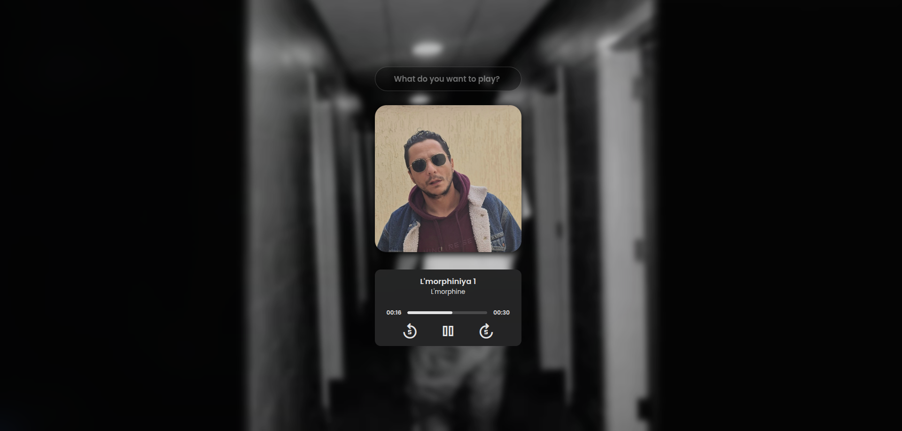
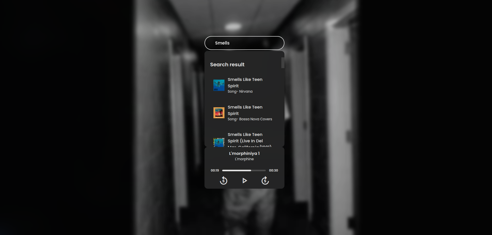

  
   <h1>🎵 Music Player App</h1>
  
A sleek web music player with search, preview, and interactive controls.

---

  
  
  
  

---

## Live Demo

[Music-player Check it out here!](https://mussic-playerrr.netlify.app/)

---

## 🌟 Overview

The **Music Player App** is a clean, modern web application that lets you:  

- Search for songs dynamically with **suggestions**
- Preview songs using 30-second clips from the **[Deezer API](https://developers.deezer.com/api)**
- Control playback: play/pause, skip forward/back, and jump using the progress bar
- Keyboard support with **Space** for play/pause
- Responsive and minimalistic design for desktop and mobile  

---

## ✨ Features

- 🎵 Search songs by name with live suggestions  
- 🖼️ Display song artwork, title, and artist  
- ▶️ Play/pause toggle with a single click or keyboard  
- ⏩ Forward/⏪ backward 5 seconds  
- ⏱️ Interactive progress bar to jump to any second  
- 📱 Fully responsive layout  

---

## 🛠️ Technologies & APIs

- **HTML5** – page structure  
- **CSS3** – styling and animations  
- **JavaScript (ES6)** – interactive behavior  
- **[Deezer API](https://developers.deezer.com/api)** – song search & previews  
- **[corsproxy.io](https://corsproxy.io/)** – bypass CORS restrictions  

---

📂 Project Structure
Music-Player/
│
├─ Assets/
│   ├─ images/      # song covers & background images & website screenshot
│   └─ songs/       # optional local audio files
│
├─ index.html       # main HTML page
├─ style.css        # app styling
└─ script.js        # app functionality

---

🎨 Screenshots

  

  

---

🔧 Usage

Type a song name in the search input.

Click a result to load it in the player.

Use play/pause, forward/back, or the progress bar to control playback.

Press Space to toggle play/pause from the keyboard.

---
📌 Notes

Only 30-second previews are available from Deezer because of copyright laws and pusblish.

Suggestions disappear when you click outside the list.

Works on both desktop and mobile devices.

